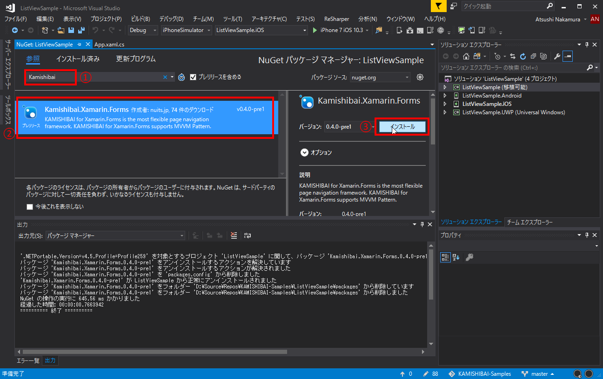
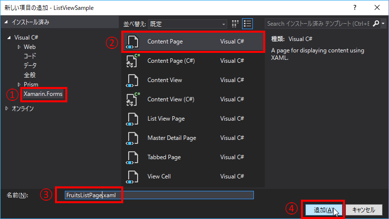

[[Home]](../README-ja.md) > KAMISHIBAIチュートリアル

# Hello, KAMISHIBAI  

Apply KAMISHIBAI to Xamarin.Forms project , create a simple sample application. Purpose is to understand the following.  

* How to apply KAMISHIBAI to applications  
* Implementation of Page navigation with type safe arguments  
   

* [Precondition](#precondition)  
* [Overview of the application](#overview-of-the-application)  
* [Steps to create](#steps-to-create)  

# Precondition  

ここでは読者が少なくとも次を満たしていることを想定しています。  

* Xamarinの開発環境が構築済みである  
* Xamarin.Formsで画面遷移が一つ以上あるアプリケーションを作成したことがある  
* ViewにViewModelのプロパティをバインドしたアプリケーションを作成したことがある

# Overview of the application  

ここでは、つぎのようはアプリケーションを作成します。  


初期画面では ListViewにフルーツの一覧を表示します。  
いずれかのフルーツが選択されると、画面遷移して選択されたフルーツを表示します。  

ここで作成するアプリの完成コードは[こちらのListViewSampleにあります](https://github.com/nuitsjp/KAMISHIBAI-Samples)ので、詰まった場合にはあわせてご覧ください。


# Steps to create  

ここではつぎの手順に従って作成していきます。  

1. [Xamarin.Formsプロジェクトの作成](#xamarinformsプロジェクトの作成)  
2. [KAMISHIBAI for Xamarin.FormsをNuGetからインストール]()  
3. [フルーツの一覧画面の作成と、初期画面遷移の変更](#フルーツの一覧画面の作成と、初期画面遷移の変更)  
4. [フルーツ選択後の画面の作成と、画面遷移の実装](#フルーツ選択後の画面の作成と、画面遷移の実装)  
5. [アプリケーションの微修正](#アプリケーションの微修正)  

## Xamarin.Formsプロジェクトの作成  

プロジェクトテンプレートの中から、「Cross-Platform」＞「Cross Platform App(Xamarin)」を選択し、名称をここでは「ListViewSample」として作成しましょう。  


作成後、実行すると次のような画面が表示されれば作成成功です。  


## KAMISHIBAI for Xamarin.FormsをNuGetからインストール  

つづいて、NuGetからKAMISHIBAIをインストールします。  
「kamishibai」で検索すると見つかるでしょう。  



KAMISHIBAIは、.NET Standardで作成されているため、関連のライブラリインストールする必要がありますので、それらも併せてインストールしましょう。  

## フルーツの一覧画面の作成と、初期画面遷移の変更  

それでは、アプリケーションの作成を開始します。  
まずは、ListViewSampleプロジェクトの下に、ViewsフォルダとViewModelsフォルダを作成してください。  

そしてViewsフォルダに最初のページを追加します。  
FruitsListPage.xamlを作成しましょう。  



作成後、開かれたXAMLにとりあえずTitle「Fruits List」を追加しておきましょう。  

```xaml
<?xml version="1.0" encoding="utf-8" ?>
<ContentPage xmlns="http://xamarin.com/schemas/2014/forms"
             xmlns:x="http://schemas.microsoft.com/winfx/2009/xaml"
             x:Class="ListViewSample.Views.FruitsListPage"
             Title="Fruits List">
    ...
```

中身を作りこむ前に、まずはKAMISHIBAIの組込みと、初期画面への遷移を修正しましょう。   
App.xaml.csファイルを開いてください。
コンストラクタにつぎのコードが記載されています。

```cs
public App()
{
    InitializeComponent();

    MainPage = new ListViewSample.MainPage();
}
```

これを、つぎのように修正します。  

```cs
public App()
{
    InitializeComponent();

    ApplicationService.Initialize(this);
    ApplicationService.SetMainPage(new NavigationPage(new FruitsListPage()));
}
```

ライブラリの初期化コードと、初期画面への遷移方法を修正しています。  
FruitsListPageはNavigationPageでラップしています。  
さあ、アプリを実行してみましょう。  
つぎのように表示されるはずです。  


無事KAMISHIBAIが組み込めましたね。  

ではFruitsListPageの中身を実装していきます。  
まずはViewModelsフォルダにつぎの３つのクラスを作成してください。  

1. ViewModelBase
2. Fruit
3. FruitsListPageViewModel

ViewModelBaseはINotifyPropertyChangedを実装した、ViewModelの基底クラスになります。  

```cs
public abstract class ViewModelBase : INotifyPropertyChanged
{
    public event PropertyChangedEventHandler PropertyChanged;
    protected virtual bool SetProperty<T>(ref T field, T value, [CallerMemberName] string propertyName = null)
    {
        if (Equals(field, value)) return false;

        field = value;
        PropertyChanged?.Invoke(this, new PropertyChangedEventArgs(propertyName));
        return true;
    }
}
```

Fruitクラスは一覧に表示するアイテムです。  
名称と色をプロパティとして保持するように実装します。  

```cs
public class Fruit
{
    public string Name { get; set; }
    public Color Color { get; set; }
}
```

つづいてFruitsListPageViewModelです。  
今回はListの内容は固定としましょう。  

```cs
public class FruitsListPageViewModel : ViewModelBase
{
    public IList<Fruit> Fruits { get; } = new List<Fruit>();

    public FruitsListPageViewModel()
    {
        Fruits.Add(new Fruit { Name = "Apple", Color = Color.Red });
        Fruits.Add(new Fruit { Name = "Orange", Color = Color.Orange });
        Fruits.Add(new Fruit { Name = "Pineapple", Color = Color.Orange });
        Fruits.Add(new Fruit { Name = "Banana", Color = Color.Goldenrod });
        Fruits.Add(new Fruit { Name = "Peach", Color = Color.DeepPink });
        Fruits.Add(new Fruit { Name = "Mango", Color = Color.Goldenrod });
        Fruits.Add(new Fruit { Name = "Melon", Color = Color.Green });
        Fruits.Add(new Fruit { Name = "Grape", Color = Color.Purple });
        Fruits.Add(new Fruit { Name = "Strawberry", Color = Color.Red });
    }
}
```

最後にFruitsListPage.xamlを修正し、ListViewにViewModelの内容を表示します。  
BindingContextへ先に作成したFruitsListPageViewModelを設定し、ListViewにFruitsListPageViewModelのFruitsの内容を表示します。

```xaml
<?xml version="1.0" encoding="utf-8" ?>
<ContentPage xmlns="http://xamarin.com/schemas/2014/forms"
             xmlns:x="http://schemas.microsoft.com/winfx/2009/xaml"
             xmlns:viewModels="clr-namespace:ListViewSample.ViewModels;assembly=ListViewSample"
             x:Class="ListViewSample.Views.FruitsListPage"
             Title="Fruits List">
    <ContentPage.BindingContext>
        <viewModels:FruitsListPageViewModel/>
    </ContentPage.BindingContext>
    <ListView ItemsSource="{Binding Fruits}">
        <ListView.ItemTemplate>
            <DataTemplate>
                <TextCell Text="{Binding Name}" TextColor="{Binding Color}"/>
            </DataTemplate>
        </ListView.ItemTemplate>
    </ListView>
</ContentPage>
```

これを実行するとつぎのように表示されます。  


これで一旦FruitsListPageをおえて、つぎの画面を作成しましょう。  

## フルーツ選択後の画面の作成と、画面遷移の実装  

まずはViewModelから作成しましょう。ViewModelsフォルダの下に、FruitDetailPageViewModelクラスを作成します。  
選択されたものを表示するためのFruitプロパティとそのフィールドを作成します。

```cs
public class FruitDetailPageViewModel : ViewModelBase
{
    private Fruit _fruit;
    public Fruit Fruit
    {
        get => _fruit;
        set => SetProperty(ref _fruit, value);
    }
}
```

つづいてViewsフォルダの下に先ほどFruitListPageを作成したのと同様の手順で、FruitDetailPageを作成してください。  
作成したらFruitDetailPage.xamlを、つぎのように実装します。

```xaml
<?xml version="1.0" encoding="utf-8" ?>
<ContentPage xmlns="http://xamarin.com/schemas/2014/forms"
             xmlns:x="http://schemas.microsoft.com/winfx/2009/xaml"
             xmlns:viewModels="clr-namespace:ListViewSample.ViewModels;assembly=ListViewSample"
             x:Class="ListViewSample.Views.FruitDetailPage"
             Title="Fruit Detail">
    <ContentPage.BindingContext>
        <viewModels:FruitDetailPageViewModel/>
    </ContentPage.BindingContext>
    <StackLayout Orientation="Horizontal" HorizontalOptions="Center" VerticalOptions="Center">
        <BoxView HeightRequest="10" WidthRequest="10" Color="{Binding Fruit.Color}"/>
        <Label Text="{Binding Fruit.Name}"/>
    </StackLayout>
</ContentPage>
```

BindingContextへFruitDetailPageViewModelがバインドされており、FruitDetailPageViewModelのFruitの各プロパティがBoxViewとLabelにバインドされているのが見て取れます。

さてそれでは、いよいよ画面遷移の実装です。  
遷移元の画面のViewModelである、FruitsListPageViewModelを修正します。  
まずは、画面遷移要求を発信するINavigationRequestをプロパティに追加します。  
今回は、画面遷移時に選択されたFruitをパラメーターとして渡しますので、型パラメーターをFruitで修飾した形で定義します。

```cs
public INavigationRequest<Fruit> RequestDetail { get; } = new NavigationRequest<Fruit>();
```

つづいてFruitが選択されたときに、RequestDetailを呼び出すコードを追加します。  

```cs
private Fruit _selectedFruit;
public Fruit SelectedFruit
{
    get => _selectedFruit;
    set
    {
        if (SetProperty(ref _selectedFruit, value) && value != null)
        {
            RequestDetail.RaiseAsync(value);
        }
    }
}
```

このコードでは画面遷移の要求を行うだけで画面遷移はしません。  
実際の画面遷移処理は、XAML側に記載します。  
FruitsListPage.xamlを開いてください。  

つぎの二点を変更します。  

1. 画面遷移の為の、PushAsyncビヘイビアを追加する  
2. ListViewのSelectedItemにSelectedFruitをバインドする

```cs
<?xml version="1.0" encoding="utf-8" ?>
<ContentPage xmlns="http://xamarin.com/schemas/2014/forms"
             xmlns:x="http://schemas.microsoft.com/winfx/2009/xaml"
             xmlns:viewModels="clr-namespace:ListViewSample.ViewModels;assembly=ListViewSample"
             xmlns:mvvm="clr-namespace:Kamishibai.Xamarin.Forms.Mvvm;assembly=Kamishibai.Xamarin.Forms"
             xmlns:views="clr-namespace:ListViewSample.Views;assembly=ListViewSample"
             x:Class="ListViewSample.Views.FruitsListPage"
             Title="Fruits List">
    <ContentPage.BindingContext>
        <viewModels:FruitsListPageViewModel/>
    </ContentPage.BindingContext>
    <ContentPage.Behaviors>
        <mvvm:PushAsync Request="{Binding RequestDetail}" x:TypeArguments="views:FruitDetailPage" />
    </ContentPage.Behaviors>
    <ListView ItemsSource="{Binding Fruits}" 
              SelectedItem="{Binding SelectedFruit, Mode=TwoWay}">
        ...
```

PushAsyncを実行するビヘイビアの部分だけ抜き出したのが、つぎのコードです。  
```cs
<mvvm:PushAsync Request="{Binding RequestDetail}" x:TypeArguments="views:FruitDetailPage" />
```

RequestDetailから画面遷移要求が発生したら、PushAsyncメソッドを利用してFruitDetailPageへ画面遷移するよう定義されていることが理解できるでしょう。  

これで画面遷移はできますが、遷移した先で選択されたFruitパラメーターを受け取る必要があります。  
画面遷移時のパラメーターはIPageInitializeAwareインターフェースのOnInitializeメソッドを実装することで受け取ることが可能です。  
今回はFruitクラスをパラメーターに受け取りたいため、FruitDetailPageViewModelを開きIPageInitializeAware<Fruit>を実装してください。  

```cs
public class FruitDetailPageViewModel : ViewModelBase, IPageInitializeAware<Fruit>
{
    public void OnInitialize(Fruit fruit) => Fruit = fruit;
```

さぁこれで、FruitListPageでFruitを選択すると、FruitDetailPageへ遷移し選択されたFruitが表示されるようになりました。  

## アプリケーションの微修正  

さて、さきの実装で完成したように見えますが、画面を戻ってみると選択された行が選択状態になったままとなっています。また選択された行を再選択することができません。  


選択状態を解除すれば良いため、今回はFruitsListPageの退場イベントを利用することにしましょう。  

FruitsListPageViewModelにIPageUnloadedAwareを実装します。

```cs
public class FruitsListPageViewModel : ViewModelBase, IPageUnloadedAware
{
    public void OnUnloaded() => SelectedFruit = null;
```

戻った後非選択状態となっており、連続して同じ行を選択できるようになりました。  


このようにKAMISHIBAIでは、画面遷移の必要なタイミングでイベントを通知する機能を含んでいます。 
ここで作成したアプリの完成コードは[こちらのListViewSampleにあります](https://github.com/nuitsjp/KAMISHIBAI-Samples)のでご覧ください。

さぁこれで入門は終了です。  
あとは[リファレンス](2-Reference-ja.md)を参照しつつ、実際にアプリケーションを作成してみましょう。  
